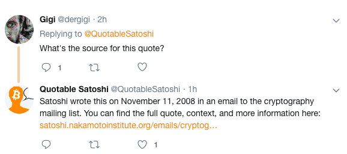

[](http://opensource.org/licenses/MIT)
[](https://github.com/dwyl/goodparts "JavaScript The Good Parts")
[](http://makeapullrequest.com) 
[](https://github.com/dwyl/goodparts/issues)
[](https://github.com/dergigi/QuotableSatoshi/issues)

[](https://twitter.com/intent/follow?screen_name=QuotableSatoshi)

A simple bot to disseminate the writings of Satoshi Nakamoto to a wider audience. Quotes are taken from [The Quotable Satoshi](https://satoshi.nakamotoinstitute.org/quotes/), curated and indexed by the [Satoshi Nakamoto Institute](https://nakamotoinstitute.org/).

~~Feel free to [follow the bot](https://twitter.com/intent/follow?screen_name=QuotableSatoshi) on twitter.~~

Follow [@QuotableSatoshi](https://njump.me/npub1satsv3728d65nenvkmzthrge0aduj8088dvwkxk70rydm407cl4s87sfhu) on nostr:

```
npub1satsv3728d65nenvkmzthrge0aduj8088dvwkxk70rydm407cl4s87sfhu
```

## Features

Quotes are posted as single tweets every 12 hours. Further, the bot will reply to users asking for "source". The bot will not post anything else. Some quotes are too long to fit a single tweet. If that is the case, sentences will be omitted until the quote is below 280 characters. The following quote

> What is needed is an electronic payment system based on cryptographic proof instead of trust, allowing any two willing parties to transact directly with each other without the need for a trusted third party. Transactions that are computationally impractical to reverse would protect sellers from fraud, and routine escrow mechanisms could easily be implemented to protect buyers.',

will be shortened to

> What is needed is an electronic payment system based on cryptographic proof instead of trust, allowing any two willing parties to transact directly with each other without the need for a trusted third party.

The bot takes a quote at random from the [NakamotoInstitute repository](https://github.com/NakamotoInstitute/nakamotoinstitute.org) and posts it to twitter. It will look something like this:


If a user replies to a queet asking for the source of a quote, the bot will reply to said user with the date of the quote and a link to the source:



The bot replies to any direct reply containing the word `source` which it did not reply to already.

## Attribution

Inspired by [@NakamotoQuotes](https://twitter.com/NakamotoQuotes). Thanks to [Pierre Rochard](https://twitter.com/pierre_rochard) and [Michael Goldstein](https://twitter.com/bitstein) for founding the Satoshi Nakamoto Institute and creating [The Quotable Satoshi](https://satoshi.nakamotoinstitute.org/quotes/). Special thanks to [Jordan Tuwiner](https://www.buybitcoinworldwide.com/) for indexing quotations.

## Further Reading

* [Bitcoin: A Peer-to-Peer Electronic Cash System](https://bitcoin.org/bitcoin.pdf) by Satoshi Nakamoto
* [The Quotable Satoshi](https://satoshi.nakamotoinstitute.org/quotes/) indexed by the Satoshi Nakamoto Institute
* [The Complete Satoshi](https://satoshi.nakamotoinstitute.org/) also by the Satoshi Nakamoto Institute
* [The Book of Satoshi](https://www.bookofsatoshi.com/) by Phil Champagne

---

Made with 🧡 by [@dergigi](https://github.com/dergigi/). Happy about any contributions. If you can't contribute but have some satoshis to spare, feel free to [send zaps](https://njump.me/dergigi.com)!

[](https://twitter.com/intent/follow?screen_name=QuotableSatoshi)
